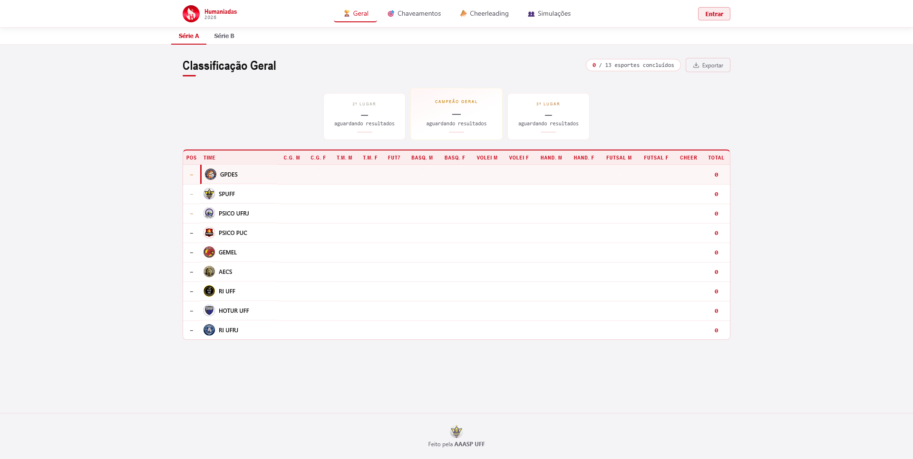

# Humaniadas 2026

Painel de acompanhamento do campeonato Humaniadas 2026 — chaveamento eliminatório, classificação geral, cheerleading e simulações por atlética.

🔗 **Deploy:** [humaniadas-2026.vercel.app](https://humaniadas-2026.vercel.app/#geral)



## Stack

- HTML/CSS/JS estático — sem bundler no client, script tags carregados em ordem fixa (ver abaixo)
- [Supabase](https://supabase.com) como backend (auth + banco de dados) via CDN no client
- `api/` — Vercel Serverless Functions (Node) para operações que exigem a chave `service_role` (bypassa RLS), nunca expostas ao client
- Deploy via Vercel: build estático (`build.js` gera `js/config.js` a partir de env vars) + as functions em `api/`

## Funcionalidades

| Aba | Descrição |
|-----|-----------|
| **Geral** | Classificação geral com pódio e tabela de pontos por esporte |
| **Chaveamentos** | Bracket eliminatório por esporte; admin preenche os resultados |
| **Cheerleading** | Ranking de colocações de cheerleading; admin preenche |
| **Simulações** | Cada usuário simula um cenário; painel mostra todas as simulações com expansão inline e paleta da atlética |

### Séries A e B

O campeonato tem duas divisões independentes: Série A (9 atléticas, chaveamento com prévia) e Série B (8 atléticas, direto pras quartas). Um toggle no topo da página troca entre elas. Qualquer usuário logado pode simular as duas séries independentemente, mesmo que o time dele seja só de uma delas — por isso `simulations` tem colunas separadas (`brackets`/`cheer` pra Série A, `brackets_b`/`cheer_b` pra Série B).

### Theming por atlética

Ao fazer login, o tema visual da página inteira muda para as cores da atlética do usuário. Cada uma das 17 atléticas (9 da A + 8 da B) tem paleta própria definida em `js/data.js` (backgrounds, accent, gold, textDim, textMid).

### Segurança

- Dados do banco escapados com `escHtml()` antes de qualquer `innerHTML`; nunca dado do banco em `onclick` inline (usar `data-*` + `addEventListener`)
- Admin verificado via `app_metadata.is_admin` no JWT (não apenas pela presença de sessão) — login é só pelo fluxo normal de "Entrar", não existe um caminho de login separado pra admin
- RLS (Row Level Security) ativo em todas as tabelas Supabase
- Exclusão de conta (self-service e via admin) roda como Serverless Function server-side com `service_role`, nunca client-side — é a única forma de apagar de fato `auth.users` (client com `anon` key não tem essa permissão)
- `SUPABASE_SERVICE_ROLE_KEY` só existe nas env vars do Vercel e em `.env.local` (gitignored) — nunca no client
- SRI (Subresource Integrity) nos dois scripts CDN externos
- `js/config.js` no `.gitignore` — não vai ao repositório

## Estrutura de arquivos

```
index.html              # Entrada única; define ordem de carregamento dos scripts
build.js                # Gera js/config.js a partir de env vars (pula se o arquivo já existir)
package.json            # Dependências npm — só usadas pelas serverless functions em api/
api/
  delete-account.js     # Serverless function: usuário apaga a própria conta (self-service)
  admin-delete-user.js  # Serverless function: admin apaga qualquer conta
  _lib/
    supabaseAdmin.js     # Cliente Supabase com service_role (server-only)
    deleteUserCascade.js # Exclusão em cascata: simulations -> profiles -> auth.users
    authenticate.js      # Extrai/valida Bearer token, compartilhado pelos dois endpoints
js/
  config.js             # SUPABASE_URL, SUPABASE_ANON_KEY, CHAMPIONSHIP_ID (não commitado)
  data.js               # TEAM_PALETTES, TEAM_COLORS, TEAM_TEXT_COLORS, BRACKETS, SPORT_NAMES, TEAM_SERIE, BRACKETS_B (Série B)
  logic.js              # computeGeneralStandings()/computeGeneralStandingsB(), isSportComplete(), POINTS_BY_PLACEMENT
  state.js              # Estado global, Supabase client, applyTeamTheme(), save/load, currentSerie, switchSerie()
  main.js               # Roteamento de views, exportRanking(), canEditBrackets()
  auth/
    admin.js            # isAdmin, updateAdminUI(), adminDeleteUser()
    user.js             # Login de usuário normal, currentUser, menu avatar, submitDeleteAccount()
  render/
    utils.js            # escHtml(), teamAvatar(), abbreviate() — carregado primeiro
    standings.js        # renderGeral(): pódio + tabela classificação
    sports.js           # renderChaveamentos(): lista de esportes
    bracket.js          # renderBracket(): chaveamento eliminatório
    cheer.js            # renderCheerleading(): posições de cheerleading
    simulacoes.js       # renderSimulacoes(): cards + expansão inline com tabela por atlética
    index.js            # renderAll(): chama todos os renders
css/
  variables.css         # CSS custom properties padrão (tema claro, accent vermelho)
  reset.css             # Reset base
  layout.css            # Shell, views, isolation: isolate, headers responsivos
  components.css        # Header, mobile nav, modais, avatar dropdown
  podium.css            # Pódio e tabela de classificação geral
  bracket.css           # Chaveamento eliminatório
  sports.css            # Cards de esporte
  cheerleading.css      # Aba cheerleading
  simulacoes.css        # Cards e tabela de simulações
img/
  teams/                # Logos das atléticas (nome_com_underscore.png)
```

## Configuração local

### Para trabalhar só no front-end (sem mexer em `api/`)

1. Crie `js/config.js` com as credenciais do projeto Supabase:

```js
const SUPABASE_URL = 'https://SEU_PROJECT_ID.supabase.co';
const SUPABASE_ANON_KEY = 'SUA_ANON_KEY';
const CHAMPIONSHIP_ID = '1';
```

2. Abra `index.html` com Live Server (VS Code) ou qualquer servidor HTTP local.  
   Não funciona abrindo o arquivo diretamente (`file://`) por conta de CORS.  
   Esse servidor **não executa** as functions em `api/` — só arquivos estáticos.

### Para testar as serverless functions em `api/` (ex: exclusão de conta)

Precisa da [Vercel CLI](https://vercel.com/docs/cli):

```bash
npm install -g vercel
vercel login
vercel link                                            # linka a pasta ao projeto na Vercel
vercel env pull .env.local --environment=production     # baixa as env vars (não-sensíveis)
vercel dev                                               # serve o site + as functions juntos
```

A `SUPABASE_SERVICE_ROLE_KEY` fica marcada como *Sensitive* no Vercel, então o `vercel env pull` não traz o valor real — precisa colar manualmente em `.env.local` (o `vercel env pull` sobrescreve o arquivo inteiro, então rode-o **antes** de editar `.env.local` à mão, nunca depois).

## Ordem dos scripts em `index.html`

A ordem é crítica — não há bundler para resolver dependências no client (a ordem real está em `index.html`, mantenha esta lista sincronizada se ela mudar):

```
config.js → data.js → logic.js → state.js
→ auth/admin.js → auth/user.js
→ render/utils.js → render/standings.js → render/sports.js → render/bracket.js
→ render/cheer.js → render/simulacoes.js → render/index.js
→ main.js
```

## Atléticas participantes

### Série A

| Atlética | Cor primária | themeAccent |
|----------|-------------|-------------|
| SPUFF | #5a3cb3 | #ffdd00 |
| RI UFRJ | #003374 | #e8f0ff |
| GPDES | #b43000 | #e56423 |
| GEMEL | #d7093a | #f4c123 |
| PSICO PUC | #c80000 | #ffe700 |
| PSICO UFRJ | #4a1a72 | #a2d14a |
| AECS | #8a6800 | #d7ae26 |
| HOTUR UFF | #020684 | #f0e0e0 |
| RI UFF | #1a3a6a | #c4c4c6 |

### Série B

| Atlética | Cor primária | themeAccent |
|----------|-------------|-------------|
| MONARCAS | #294E95 | #E0B229 |
| RI UERJ | #F6510C | #FF7920 |
| DGEI UFRJ | #A9496C | #B8B6C1 |
| GEO UFF | #39626E | #DEA83B |
| HIST UFF | #D10905 | #FAB420 |
| GALUDA DE CP | #283D68 | #D4AF6A |
| HIST UNIRIO | #184E44 | #E8C468 |
| CORUJAS UERJ | #3D3B76 | #EFC117 |

## Convenções importantes

- **`themeAccent`** (não `accent`) é o valor aplicado ao CSS `--accent`. `accent` pode ser escuro demais para texto.
- **Theming 100% via CSS custom properties**, inclusive o header — nunca hardcodear cor de UI. `applyTeamTheme()`/`resetTeamTheme()` em `js/state.js` setam/limpam as vars no `:root`.
- **Gold reservado só pra medalhas** (1º/2º/3º no pódio) — qualquer outro destaque usa `var(--accent)`.
- **Ações destrutivas usam `var(--danger)` fixo**, não seguem a paleta da atlética — sinal visual precisa ser universal, não se camuflar no tema local.
- **Ícones são SVG inline, não emoji** — emoji não renderiza de forma confiável em todo navegador/SO.
- **`escHtml()`** obrigatório em todo dado do banco antes de `innerHTML`. A injeção via `onclick` não é segura com escaping simples — usar `data-*` + `addEventListener`.
- **`canEditBrackets()`** (`js/main.js`) é a fonte única de verdade pra permissão de editar/limpar chaveamento (`isAdmin || (currentUser && !viewingOfficial)`). Sempre chamar `updateAdminUI()` depois de mudar `isAdmin`/`currentUser`/`viewingOfficial`, senão a visibilidade dos botões de limpar fica desatualizada.
- **Sem `ON DELETE CASCADE` no schema** — `simulations.user_id → profiles.id` e `profiles.id → auth.users.id` são sem cascade. Exclusão de usuário sempre na ordem `simulations` → `profiles` → `auth.users` (centralizado em `api/_lib/deleteUserCascade.js`).
- **`CHAMPIONSHIP_ID` é sempre string** — `championship_state.id` é `text` no schema, nunca tratar como `Number()`.
- **Admin não tem linha em `profiles`** — por design. Queries de "conta órfã" devem excluir quem tem `app_metadata.is_admin = true`.
- **SRI**: se atualizar versão de `@supabase/supabase-js` ou `html2canvas`, recalcular SHA-384 e atualizar `integrity=` em `index.html`.
- **`isolation: isolate` no `.shell`** — não remover; garante que conteúdo da página fique abaixo dos overlays do menu mobile.
- **`.mobile-nav` fora do `<header>`** — não mover; `backdrop-filter` no header quebra `position: fixed`.

## Admin

Não existe login separado pra admin — é a mesma tela de "Entrar" de qualquer usuário. `onSignIn()` detecta `app_metadata.is_admin` no JWT e ativa o modo admin automaticamente.

Para marcar um usuário como admin, atualize `app_metadata` via Supabase Dashboard ou SQL:

```sql
UPDATE auth.users
SET raw_app_meta_data = raw_app_meta_data || '{"is_admin": true}'
WHERE email = 'admin@exemplo.com';
```
